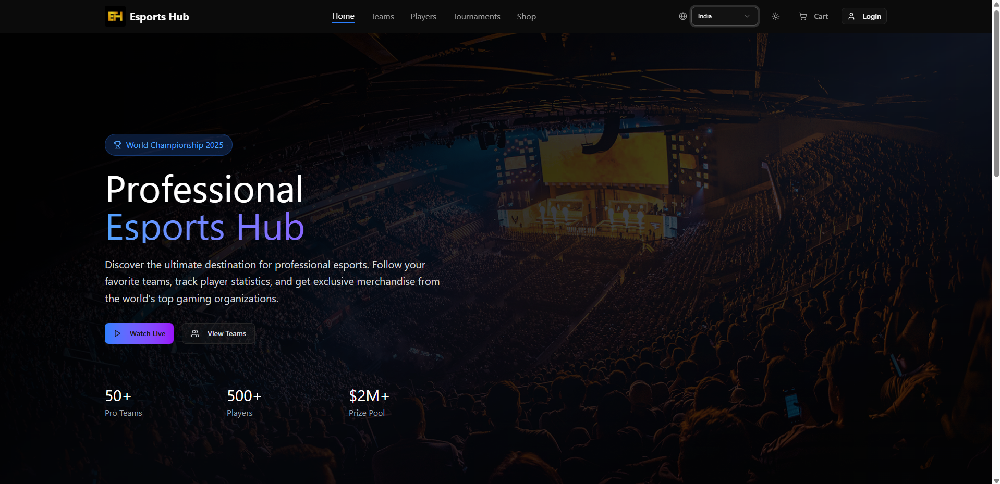
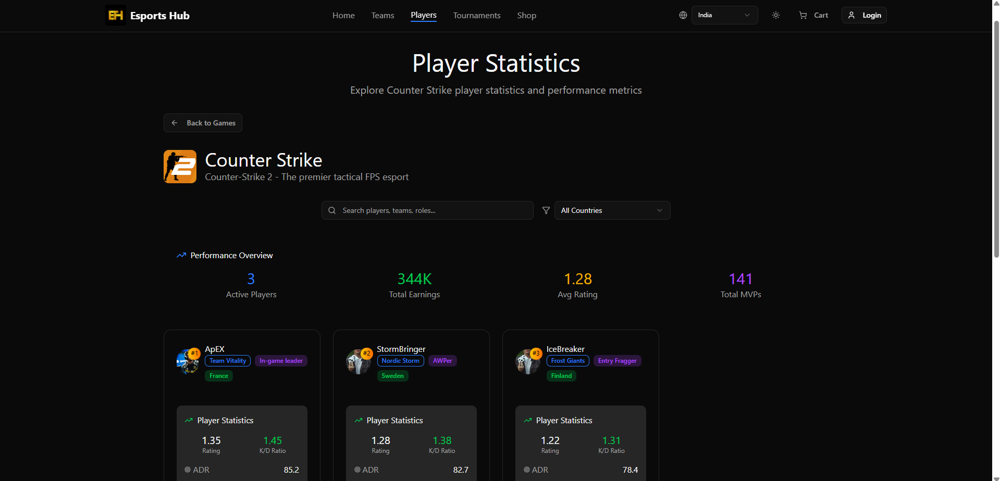
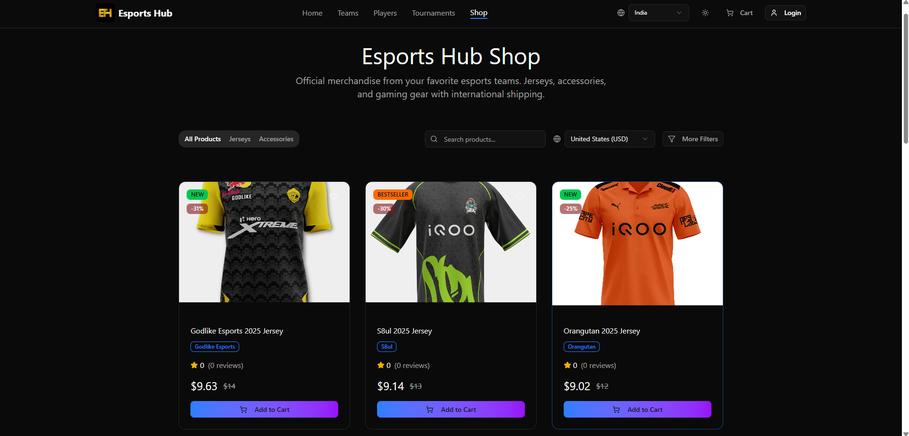

# 🎮 E-Sports Hub

**E-Sports Hub** is a unified digital platform designed to bring esports fans closer to their favorite teams by combining **merchandise shopping, real-time player statistics, and fan engagement tools** into a single ecosystem.

This project was developed as an academic mini project under the **Department of CSE (AIML)** at **SSPM’s College of Engineering, Kankavli**.

---

## 📌 Project Overview

The rapid growth of eSports has transformed gaming into a mainstream competitive industry with a massive global fanbase. However, fans often rely on multiple platforms to track player performance, follow team progress, and purchase official merchandise.

**E-Sports Hub** addresses this challenge by providing a **one-stop platform** where fans can:
- Explore and purchase official team merchandise  
- View detailed player statistics and leaderboards  
- Engage with esports content through a clean and intuitive interface  

---

## ❗ Problem Statement

Currently, esports fans face the following issues:
- Player statistics, team performance, and merchandise are scattered across multiple platforms  
- Lack of a unified, fan-centric digital ecosystem  
- Inefficient navigation and fragmented user experience  

This creates inconvenience and reduces fan engagement.

---

## 💡 Proposed System

The proposed system integrates multiple esports services into a single web platform:

- 🛒 **Merchandise Store**  
  - Jerseys and official team apparel  

- 📊 **Player Statistics**  
  - Real-time stats  
  - Performance analysis  
  - Leaderboards  

- 🎨 **Responsive User Interface**  
  - Optimized for desktop users  
  - Clean and modern UI  

- 💳 **Secure Payment Gateway**  
  - Integrated with **Razorpay / Stripe** for safe checkout  

---

## 🛠 Tech Stack Used

### Frontend
- HTML  
- CSS  
- JavaScript  
- React.js / Next.js  

### Backend
- Node.js  
- Express.js  

### Database
- Supabase  

### UI & Design  
- Figma  

### Payments
- Razorpay  

---

## ⭐ Key Features

- One-stop platform for esports merchandise and player stats  
- Real-time performance insights and leaderboards  
- Secure and scalable architecture  
- Fast and user-friendly navigation  
- Quick and secure checkout process  

---

## 📈 Advantages

- Saves user time by combining multiple services in one place  
- Enhances fan engagement through data-driven insights  
- Secure payment handling  
- Scalable system design for future expansion  
- Improved overall user experience  

---

## 🎯 Applications

- Esports fan engagement platforms  
- Team-specific digital ecosystems  
- Merchandise and stats portals  
- Academic and learning-based web projects  

---

## 👥 Project Team

- **Pranav Rajendra Ithape**  
- **Khalid Imam Jethi**  
- **Pranav Dilip Misal**  
- **Gaurav Vinod More**

---

## 👨‍🏫 Project Guide

**Prof. P. A. Ghadigaonkar**  
Department of CSE (AIML)  
SSPM’s College of Engineering, Kankavli  

---

## 📚 References

1. Brock, T., & Crawford, G. *The esports experience economy*, Internet Research, 2024  
2. Noroozi et al. *Machine learning approach for eSports player classification*, arXiv, 2024  
3. Kumar et al. *Study on esports consumer behavior*, Baltic Journal of Law & Politics, 2023  
4. Zhang & Naidu. *SIDO Performance Model for League of Legends*, arXiv, 2024  
5. Hamari & Sjöblom. *What is eSports and why do people watch it?*, Internet Research, 2017  

---

## 🏁 Conclusion

E-Sports Hub bridges the gap between esports teams and their fans by delivering a **centralized, interactive, and commerce-enabled platform**.  
By combining performance analytics with merchandise and engagement tools, the platform enhances the overall esports fan experience.

---

## 📸 Screenshots

### 🏠 Home Page
Displays featured esports teams, navigation menu, and latest updates.

---

### 📊 Player Statistics
Shows player performance, stats, and leaderboards.

---

### 🛒 Merchandise Store
Allows users to browse and purchase official team merchandise & accessories.

---

## 📄 License

This project is developed for **academic and educational purposes**.
